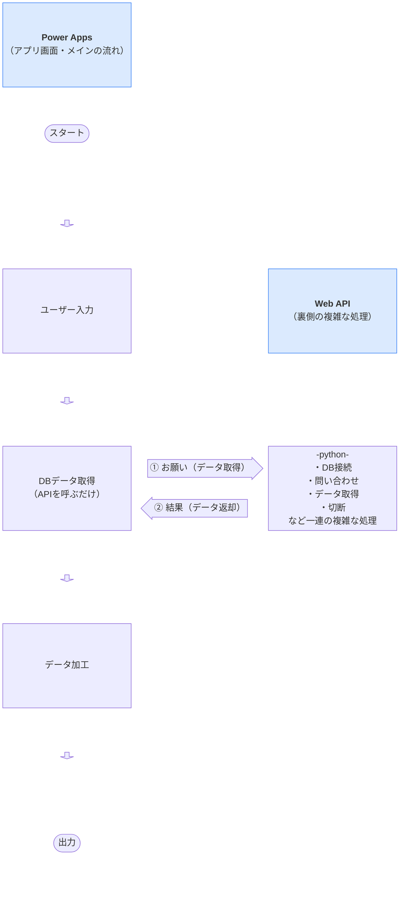

```mermaid
block-beta
    columns 3

    %% 1行目：Power Apps タイトル
    PA_Title["<b>Power Apps</b><br>（アプリ画面・メインの流れ）"]
    space
    space

    %% 2行目：スタート
    Start(["スタート"])
    space
    space

    %% 矢印（縦の間隔を広げる）
    A1<[" "]>(down)
    space
    space

    %% 3行目：ユーザー入力 と Web API タイトル
    Input["ユーザー入力"]
    space
    API_Title["<b>Web API</b><br>（裏側の複雑な処理）"]

    %% 矢印（縦の間隔を広げる）
    A2<[" "]>(down)
    space
    space

    %% 4行目：DBデータ取得 ⇔ 往復矢印ブロック ⇔ Web API本体
    GetDB["DBデータ取得<br>（APIを呼ぶだけ）"]
    block:Arrows
        columns 1
        Req<["① お願い（データ取得）"]>(right)
        Res<["② 結果（データ返却）"]>(left)
    end
    API_Box["-python-<br>・DB接続<br>・問い合わせ<br>・データ取得<br>・切断<br>など一連の複雑な処理"]

    %% 矢印（縦の間隔を広げる）
    A3<[" "]>(down)
    space
    space

    %% 5行目：データ加工
    Process["データ加工"]
    space
    space

    %% 矢印（縦の間隔を広げる）
    A4<[" "]>(down)
    space
    space

    %% 6行目：出力
    Output(["出力"])
    space
    space

    %% スタイル調整（矢印ブロックの外枠を消し、見出しに色を付ける）
    style Arrows fill:none,stroke:none
    style PA_Title fill:#dbeafe,stroke:#3b82f6
    style API_Title fill:#dbeafe,stroke:#3b82f6
```
